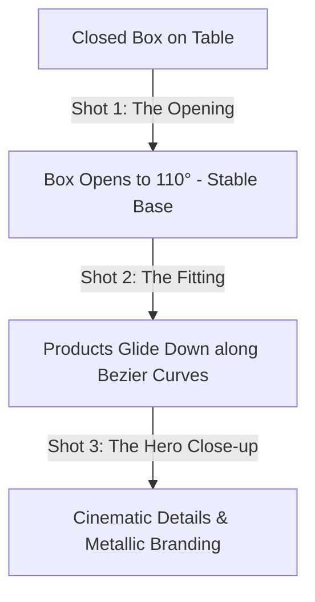

# Aurel Leather — 3D Video Production Guide
*Authoritative Prompt Sheets & Multi-Shot Production Strategy for Luxury B2B Campaigns*

This guide outlines the technical analysis, prompt structures, and generation settings required to produce a premium, flawless 8-second luxury commercial animation for Aurel Leather. It addresses the physical, mechanical, and visual consistency anomalies present in `assets/3d-video.mp4` by employing a advanced **3-Shot Production Strategy**.

---

## 1. Analysis of V1 Flaws (`assets/3d-video.mp4`)
A critical review of the current draft reveals several major anomalies that break the suspension of disbelief and erode the premium "luxury commercial" feeling:

1. **Box Morphing & Shape Shifting:** The gift box starts as a presentation box, morphs into a vertical cabinet midway, and lands with different geometric proportions. This is caused by asking the model to perform too many complex structural transitions in a single long shot.
2. **Lid Detachment (Hinge Failure):** The lid loses its physical hinge relationship to the base, floating independently like a detached video game asset.
3. **Product Hierarchy Chaos:** The wallets begin sliding and floating before the lid has fully opened, distracting the viewer and making the movement feel unnatural.
4. **Uncontrolled Rotations:** The products rotate violently on multiple axes (tumbling and spinning), which looks cheap and resembles floating 3D game assets rather than static, heavy luxury leather goods.
5. **Scale Inconsistency:** The relative size of the wallets changes throughout the motion, breaking physical proportions.
6. **Compartment Continuity Breaks:** The interior tray and compartments appear, disappear, and modify their layout mid-animation.
7. **Weak Camera Choreography:** Both the camera and the objects are moving aggressively, causing visual fatigue and destroying the high-end product-commercial pacing.
8. **Loss of Leather & Stitch Detail:** As motion speeds up, the micro-details (leather pebble grain, physical stitching threads, painted edges) blur and disappear.
9. **Lighting & Branding Inconsistencies:** The gold foil Aurel logo loses legibility, and shadows/reflections distort unrealistically.
10. **Rushed Pacing:** The movement is fast and hectic. Luxury commercials require slow, deliberate, heavy, and satisfying motion.

---

## 2. The Solution: The 3-Shot Strategy
To achieve absolute structural fidelity, zero morphing, and a high-end editorial feel, the animation is split into **three distinct shots**. Generating these separately allows the AI model to maintain high detail, physical consistency, and perfect composition.

---

## 3. Shot-by-Shot Prompt Sheets & Parameters

---

### Shot 1: The Opening (Duration: 2.5s)
* **Visual Goal:** A slow, heavy, dramatic reveal. The camera remains stationary. The rigid-body matte-black gift box opens smoothly from a closed position, pivoting exactly 110 degrees on its rear hinge, revealing the clean, empty beige velvet compartment trays.

#### Universal Master Prompt
> **Prompt:** Premium, photorealistic, 8k resolution, luxury studio commercial for Aurel Leather. A rigid matte-black gift box is resting on a highly polished black marble table. The camera is completely stationary, locked on a tripod, front-facing view, with a very subtle 1% dolly-in. The environment is a dark, premium luxury studio with deep golden rim lighting and soft shadows. The elegant gift box slowly and smoothly opens its lid from a closed position. The lid remains permanently and securely attached to the box base via a thick, visible gold-accented rear hinge. The lid pivots slowly and steadily around the hinge axis to an angle of 110 degrees. The box base remains absolutely still and rigid. Zero morphing, zero shape-shifting, zero topology changes. The interior reveals elegant, clean, empty beige velvet compartments. Luxury cinematic pacing, extremely slow and deliberate motion.

#### Runway Gen-3 Alpha Prompt & Settings
* **Prompt:** `A premium luxury product commercial. Front-facing stationary shot of a rigid matte-black luxury gift box opening on a polished black marble table. Extremely slow and smooth motion. The lid is physically attached to a heavy rear hinge and opens to 110 degrees. Empty beige velvet trays inside. Dark luxury studio environment, soft golden rim lighting, highly detailed pebble leather texture on the box. Absolute zero morphing, zero scale changes, rigid body physics. 8k resolution, cinematic, photorealistic, 60fps.`
* **Motion Strength:** `3` (Keep motion low to prevent the box base from moving or warping)
* **Upscale:** `On`
* **Aspect Ratio:** `16:9`

#### Kling 1.5 Prompt & Settings
* **Prompt:** `High-end luxury advertising, 8k resolution. A luxurious rigid presentation box sits on a polished black marble table. Camera is locked, no movement, extremely stable. The box lid opens slowly and smoothly from a closed position, rotating 110 degrees on a permanent rear hinge. Box base and interior trays remain perfectly static and unchanged. Soft key light, premium golden reflections, photorealistic leather grain on box. Rigid body dynamics, zero morphing.`
* **Mode:** `Professional`
* **Camera Movement:** `None (or static)`
* **Creativity vs. Relevance:** `Relevance: 8/10`

#### Luma Dream Machine Prompt & Settings
* **Prompt:** `A cinematic slow-motion commercial shot of a luxury black gift box opening, revealing empty beige velvet trays. Polished black marble background, gold reflections. Camera is completely static. The lid stays attached to the hinge and rotates smoothly. Photorealistic, 8k, highly detailed leather textures, premium product shot.`
* **Enhance Prompt:** `Off` (Ensures prompt constraints are not overridden)

---

### Shot 2: The Fitting (Duration: 3.5s)
* **Visual Goal:** The empty open box sits stable on the black marble. Four luxury leather products (Black Executive Notebook, Brown Zip Wallet, Black Card Holder, Brown Long Wallet) slowly and elegantly glide down along controlled, gentle Bezier curves into their matching compartment slots with millimeter precision.

#### Universal Master Prompt
> **Prompt:** Premium, photorealistic, 8k resolution, luxury studio commercial for Aurel Leather. The rigid matte-black gift box is already open at 110 degrees and sits completely static on a polished black marble table. The camera is stationary, front-facing, with a subtle 1% dolly-in. Four luxury full-grain leather products (1. Black Executive Notebook Wallet, 2. Brown Zip Wallet, 3. Black Card Holder, 4. Brown Long Wallet) float slightly above the box. The products slowly and gracefully glide downward into their dedicated, perfectly fitted beige velvet compartments. The products follow smooth, linear Bezier paths. Zero spinning, zero tumbling, absolute zero violent rotation. Maximum tilt is 5 degrees. The products land with millimeter precision in their respective compartments. No clipping, no bouncing, no shape-shifting. Ultra-realistic leather pebble grain and stitching details remain perfectly sharp. Golden logo reflections.

#### Runway Gen-3 Alpha Prompt & Settings
* **Prompt:** `Premium product commercial. An open rigid matte-black gift box sits static on a black marble table. Four luxury leather products—a black notebook, brown zip wallet, black cardholder, and brown long wallet—descend slowly and slide perfectly into their custom velvet slots. Zero spinning, zero tumbling, extremely smooth and gentle glide, landing with precision. High detail leather grain, sharp stitching, soft golden lighting. 8k, photorealistic, rigid-body physics.`
* **Motion Strength:** `4` (Slightly higher to drive the smooth glide of the products)
* **Aspect Ratio:** `16:9`

#### Kling 1.5 Prompt & Settings
* **Prompt:** `High-end luxury advertising, 8k. Four premium leather accessories (black notebook, brown zip wallet, cardholder, long wallet) float down slowly and dock with perfect precision into the custom velvet trays of a static, open luxury box. Extremely stable box geometry, perfect proportions. No morphing, no tumbling, slow-motion Bezier movement, smooth landing. High-end lighting, realistic leather pebble-grain and gold foil stamps.`
* **Mode:** `Professional`
* **Relevance:** `9/10`

#### Luma Dream Machine Prompt & Settings
* **Prompt:** `A beautiful, cinematic shot of premium leather wallets and a notebook descending slowly and fitting with millimeter precision into a luxury gift box's beige velvet compartments. Static camera, rich studio lighting, perfect leather textures, gold foil reflections, luxury pacing.`

---

### Shot 3: The Showcase (Duration: 2.0s)
* **Visual Goal:** The absolute hero shot. A very subtle cinematic dolly-in showing the fully assembled, luxurious gift box with all products perfectly nested. The soft key light glides across the elegant gold foil Aurel logo, catching the metallic reflections and the exquisite pebble leather textures.

#### Universal Master Prompt
> **Prompt:** Premium, photorealistic, 8k resolution, luxury product commercial for Aurel Leather. A fully assembled luxury gift box sits on a polished black marble table, holding four premium leather products perfectly nested in beige velvet compartments. The camera is stationary and performs a very slow, elegant cinematic dolly-in of 2%. Soft luxury key lighting glides across the scene, catching the highly detailed, sharp pebble grain texture of the leather and individual stitching threads. The elegant gold foil embossed Aurel logo on the lid and products shines with highly realistic metallic gold reflections and sharp readability. Absolute zero motion of objects, zero morphing, zero clipping. Pristine, high-end editorial product commercial look, deep rich contrast.

#### Runway Gen-3 Alpha Prompt & Settings
* **Prompt:** `Luxury product close-up, hero shot. A stationary open black gift box holding a leather notebook, cardholder, and wallets in beige velvet. Extremely slow cinematic dolly-in. Studio key light moves slightly, creating rich golden metallic reflections on the Aurel gold foil logo. Ultra-detailed full-grain leather textures, visible stitching, polished marble table, dark luxury background. 8k resolution, photorealistic.`
* **Motion Strength:** `2` (Very low to ensure absolute pixel stability and focus on micro-textures)
* **Aspect Ratio:** `16:9`

#### Kling 1.5 Prompt & Settings
* **Prompt:** `Hero shot of luxury corporate gift set, 8k. Open matte-black box containing premium leather notebook and wallets. Completely static scene, subtle dolly-in camera motion. Professional studio lighting sweeps slowly, highlighting gold foil Aurel logo, deep leather pebble textures, and meticulous stitching. Ultra-realistic, commercial advertising quality, elite branding.`
* **Mode:** `Professional`
* **Relevance:** `9/10`

---

## 4. Key AI Generation Parameter Best Practices

To ensure maximum visual quality and consistency across all shots:

| Parameter | Recommended Value | Reason |
| :--- | :--- | :--- |
| **Motion Strength / Scale** | `2 - 4` (Low) | High values cause the model to introduce hallucinations, shape-shifting, and structural distortion. |
| **FPS (Frames Per Second)** | `60 fps` (or `30 fps` high-quality) | Provides smooth, premium cinematic motion. Slow-motion looks best at high frame rates. |
| **Seed Locking** | Lock seeds if combining prompts | Crucial for keeping the leather texture, marble grain, and lighting values identical between shots. |
| **Negative Prompts** | `morphing, shape shifting, warping, cabinet, floating lid, cartoon, blurry, low quality, distorted logo` | Explicitly bans the common bugs of AI video generators. |

---

## 5. How to Assemble the Final Commercial

Once you have generated the three shots:
1. **Import the clips** into your editing software (Premiere, DaVinci Resolve, or CapCut).
2. **Apply a cross-dissolve or clean jump cut** at the boundaries:
   - **Cut 1 (at 2.5s):** Transition from the end of the lid opening to the start of the products descending. Because the box position and camera angle are identical, the transition will be completely seamless.
   - **Cut 2 (at 6.0s):** Transition from the completed product landing to the close-up hero details shot. A subtle cross-dissolve will emphasize the luxury craftsmanship.
3. **Color Grade:** Apply a warm, rich LUT with high contrast, bringing out the deep blacks of the marble and the golden highlights of the logo.
